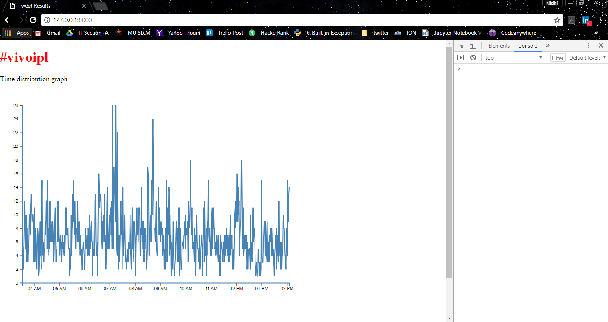
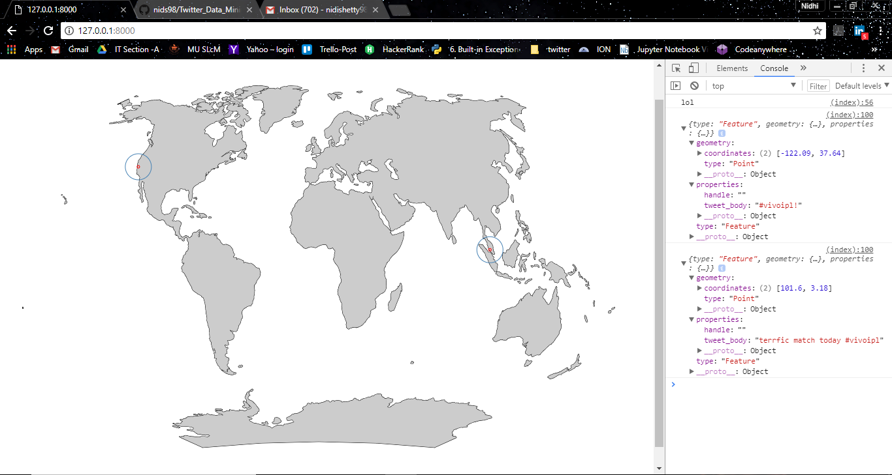

# Twitter Data Mining and Visualisation using D3.js

- Tweets were scraped using Twitter API and Tweepy(Python library for accessing Twitter API)
- Streaming API fetched tweets having #vivoipl and the data was used to analyse:
  * The total no. of Tweets
  * Unique users
  * No. of Tweets with media
  * Tweets with most retweets
  * Tweets with most favourite count
  * Tweet count for each location
- To visualise Time distribution, a CSV file with count and time was created using tweet data and was loaded to D3. The distribution was visualised using line graph using D3
- To visualise the Location Distribution, a geo JSON file was created which contains the latitude and longitude of the twetted users and a another World JSON file was created using GDAL and topojson which plots the world map on which geo data is projected upon.

# Time Distribution

# Location Distribution

